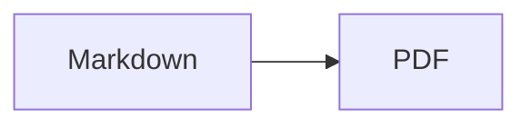

# md2pdf

离线 Markdown 转 PDF Docker 工具。运行阶段禁用网络，使用 Pandoc、XeLaTeX、Noto CJK 字体和预装的 Mermaid CLI 生成适合打印的 PDF。

## 构建镜像

```bash
docker build -t md2pdf:latest .
```

## 使用

```bash
./md2pdf.sh [INPUT] [OUTPUT_DIR]
```

示例：

```bash
./md2pdf.sh README.md
./md2pdf.sh docs dist-pdf
./md2pdf.sh
```

规则：

- `INPUT` 默认为当前目录。
- 文件输入只接受 `.md`。
- 目录输入会递归转换所有 `.md`。
- 不指定 `OUTPUT_DIR` 时，PDF 写在源文件目录。
- 指定 `OUTPUT_DIR` 时，所有 PDF 扁平写入该目录；同名冲突会报错。
- 相对图片路径按源 Markdown 所在目录解析。

## Mermaid

普通代码围栏会在容器内预渲染为高清 PNG：

````markdown

````

## 安全默认值

`md2pdf.sh` 使用以下 Docker 运行参数：

- `--network none`
- `--read-only`
- `--tmpfs /tmp:rw,nosuid,nodev,noexec,size=512m`
- `--tmpfs /run:rw,nosuid,nodev,noexec,size=64m`
- `--security-opt no-new-privileges`
